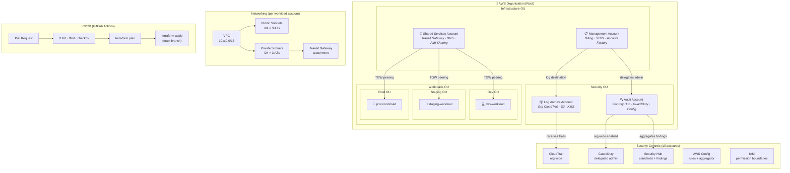

# AWS Landing Zone — Terraform

> Infrastructure-as-code for a secure, multi-account AWS environment following the AWS Well-Architected Framework and AWS Security Reference Architecture.

---

## Architecture



---

## Account structure

| Account | OU | Purpose |
|---|---|---|
| Management | Infrastructure | Org root, billing, SCPs, Control Tower (optional) |
| Log Archive | Security | Immutable S3 buckets for all org CloudTrail + Config logs |
| Audit | Security | Security Hub, GuardDuty, Config aggregator — read-only across org |
| Shared Services | Infrastructure | Transit Gateway, Route 53 resolver, shared AMIs |
| dev / staging / prod | Workloads | Application workloads, isolated per environment |

---

## Repo layout

```
landing-zone/
├── bootstrap/                  # Run once — creates S3 state bucket + org structure
│   ├── management-account/
│   └── s3-tfstate/
├── accounts/                   # Per-account Terraform roots
│   ├── management/
│   ├── log-archive/
│   ├── audit/
│   ├── shared-services/
│   └── workloads/
│       ├── dev/
│       ├── staging/
│       └── prod/
├── modules/                    # Reusable modules (no state)
│   ├── org/
│   ├── networking/
│   ├── security-baseline/
│   ├── logging/
│   ├── iam-roles/
│   ├── scp-policies/
│   └── budgets/
├── environments/               # Per-env variable files
│   ├── dev.tfvars
│   ├── staging.tfvars
│   └── prod.tfvars
├── policies/
│   ├── scps/                   # Service Control Policy JSON
│   └── permission-boundaries/
├── .github/
│   └── workflows/              # CI/CD pipelines
├── docs/
│   ├── adr/                    # Architecture Decision Records
│   └── runbooks/
├── Makefile
├── .pre-commit-config.yaml
├── .tflint.hcl
├── .terraform-version
└── README.md
```

---

## Prerequisites

- [Terraform](https://developer.hashicorp.com/terraform/downloads) ≥ 1.6
- [AWS CLI](https://docs.aws.amazon.com/cli/latest/userguide/install-cliv2.html) v2, configured with management account credentials
- [pre-commit](https://pre-commit.com/) — for local linting hooks
- Permissions: `AdministratorAccess` on the management account for bootstrap; `OrganizationAccountAccessRole` for subsequent account deployments

---

## Quick start

### 1. Bootstrap (once per org)

```bash
# Create the remote state bucket + DynamoDB lock table
cd bootstrap/s3-tfstate
terraform init && terraform apply

# Set up org structure, OUs, and account factory
cd ../management-account
terraform init && terraform apply
```

### 2. Deploy core accounts

```bash
# Order matters: log-archive → audit → shared-services → workloads
for account in log-archive audit shared-services; do
  cd accounts/$account
  terraform init -backend-config=../../environments/prod.tfvars
  terraform apply -var-file=../../environments/prod.tfvars
  cd ../..
done
```

### 3. Deploy SCPs

```bash
cd policies/scps
terraform init && terraform apply
```

### 4. Deploy a workload account

```bash
cd accounts/workloads/dev
terraform init -backend-config=../../../environments/dev.tfvars
terraform plan -var-file=../../../environments/dev.tfvars
terraform apply -var-file=../../../environments/dev.tfvars
```

---

## Module reference

| Module | Key inputs | Key outputs |
|---|---|---|
| `org/` | `org_id`, `root_id`, `ou_names` | `ou_ids`, `account_ids` |
| `networking/` | `vpc_cidr`, `azs`, `tgw_id` | `vpc_id`, `subnet_ids`, `tgw_attachment_id` |
| `security-baseline/` | `account_id`, `region`, `log_bucket_arn` | `guardduty_detector_id`, `hub_arn` |
| `logging/` | `org_id`, `kms_key_arn` | `trail_arn`, `log_bucket_arn` |
| `iam-roles/` | `trusted_account_ids`, `permission_boundary_arn` | `role_arns` |
| `scp-policies/` | `target_ou_ids`, `policies` | `policy_ids` |
| `budgets/` | `monthly_limit_usd`, `alert_emails` | `budget_arns` |

---

## CI/CD

Every pull request triggers:

1. `terraform fmt -check` — formatting
2. `tflint` — Terraform linting
3. `checkov` — security/compliance static analysis
4. `terraform plan` — plan output posted as PR comment

Merge to `main` triggers `terraform apply` per changed account (detected via path filters).

See [`.github/workflows/`](.github/workflows/) for pipeline definitions.

---

## Tagging strategy

All resources receive a common tag set defined in each account root:

```hcl
locals {
  common_tags = merge(var.tags, {
    Environment = var.environment
    AccountId   = data.aws_caller_identity.current.account_id
    ManagedBy   = "terraform"
    Repo        = "landing-zone"
  })
}
```

---

## Contributing

See [CONTRIBUTING.md](CONTRIBUTING.md). Branching strategy: `feature/*` → PR → `main`. All PRs require one review and a passing plan.

Architecture decisions are logged in [`docs/adr/`](docs/adr/).

---

## License

MIT
